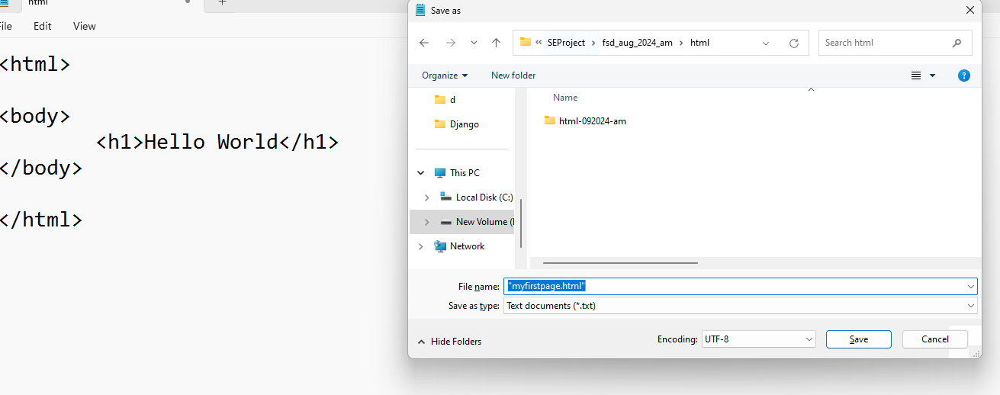

# html-092024-am

### Setup Instructions
[Installing VS Code](https://code.visualstudio.com/download)

[Step by step guide](https://www.geeksforgeeks.org/how-to-install-visual-studio-code-on-windows/)

### learning HTML
[W3School HTML](https://www.w3schools.com/html/)

### Creating a first html page using a notepad

open the notepad 

and type the following code in it 

<html>

<body>
	<h1>Hello World</h1>	
</body>

</html>

save the file with "firstpage.html" 

[link](https://www.w3schools.com/html/html_editors.asp)

### Usefull Resources

[Lorem](https://www.lipsum.com/)

### For images

[Getty Images](https://www.gettyimages.ca/)
[Unsplash](https://unsplash.com/)
[Pexels](https://www.pexels.com/)
[Icons](https://icons8.com/icons/set/button)

### Bootstrap
[Quick Start](https://getbootstrap.com/docs/5.3/getting-started/introduction/#quick-start)
[carousel](https://getbootstrap.com/docs/5.3/components/carousel/)
[Examples](https://github.com/twbs/examples/)

### Colors

[colors](https://coolors.co/)

### Escape Characters **Reference**

[Escape Characters Reference](https://developer.mozilla.org/en-US/docs/Glossary/Character_reference)

### em
--Relative to the font size of the parent element.
--Commonly used for font sizes, spacing, and layout.
--Example: If the parent element has a font size of 16px, 1em equals 16px.

### rem
--Relative to the font size of the root element (usually the <html> element).
--More predictable than em because it doesn't depend on the parent element.
--Example: If the root element has a font size of 16px, 1rem equals 16px.
px (pixels)

### Absolute unit.
--Represents a fixed size regardless of the screen size or resolution.
--Example: 16px is always 16 pixels.

### vh (viewport height)
--Relative to 1% of the viewport's height.
Useful for responsive designs.
--Example: 100vh equals the full height of the viewport.

### vw (viewport width)
--Relative to 1% of the viewport's width.
Also useful for responsive designs.
--Example: 100vw equals the full width of the viewport.